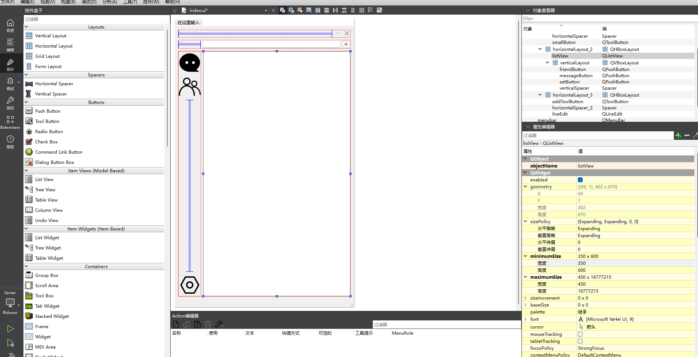

#                                            开发日记

#### 2025-6-8

数据表结构

```Mermaid
erDiagram
    users ||--o{ friendships : "account"
    friendships }|--|| users : "account"
    messages }o--|| users : "sender"
    messages }o--|| users : "receiver"

    users {
        INT id PK "主键，自增"
        VARCHAR(20) account "唯一账号"
        VARCHAR(20) password "密码"
        VARCHAR(20) nickname "昵称"
    }
    
    friendships {
        INT id PK "主键，自增"
        VARCHAR(20) user1_account "发起方账号"
        VARCHAR(20) user2_account "接收方账号"
        INT status "状态 (0-待确认, 1-已同意)"
    }
    
    messages {
        INT id PK "主键，自增"
        VARCHAR(50) sender "发送者账号"
        VARCHAR(50) receiver "接收者账号"
        TEXT content "消息内容"
        VARCHAR(50) time "发送时间"
    }
```


### 2025-6-2

#### 好友表

```sql
create table friendships(
   id int primary key auto_increment,
   user1_account varchar(20) not null,
   user2_account varchar(20) not null,
   status int default 0,//0:待处理，1：同意，2：拒绝   一定时间统一删除拒绝和待处理的好友关系
   constraint fk_user1_account foreign key(user1_account) references users(account),
   constraint fk_user2_account foreign key(user2_account) references users(account),
   constraint unique_friendship unique(user1_account,user2_account)
);
```

#### 发送好友申请

```c++
void Information::sendPushClick(){
    QString v_account=viewer["account"].toString();//查看者的账号
    //向服务端发送好友申请
    QJsonObject jsonObject;
    jsonObject["type"]="friend_request";
    jsonObject["v_account"]=v_account;
    jsonObject["account"]=account;
    ui->nicknamelabel->setText(nickname);
    ui->accountlabel->setText(account);
    QByteArray byte=QJsonDocument(jsonObject).toJson();
    
    socket->write(byte);
}

```

#### 服务端处理好友申请请求

```c++
else if(type=="friend_request"){
            response["type"]="friend_request_response";
            QString v_account=jsonObject["v_account"].toString();
            QString account=jsonObject["account"].toString();
            QSqlQuery query;
            query.prepare("insert into friendships(user1_account,user2_account,status) values(:v_account,:account,0);");
            query.bindValue(":v_account",v_account);
            query.bindValue(":account",account);
            if(query.exec()){
                response["result"]="insert_successed";
            }else{
                qDebug()<<query.lastError();
                response["result"]="insert_not_successed";
            }
        }
```

#### 好友管理界面发出查看好友关系的申请

```c++
account =js["account"].toString();
QJsonObject jsonobect;
jsonobect["type"]="View_friend_relationships";
jsonobect["account"]=account;
QByteArray byte=QJsonDocument(jsonobect).toJson();
socket->write(byte);
```

#### 服务端处理查看好友关系的申请

```c++
else if(type=="View_friend_relationships"){
            QString account =jsonObject["account"].toString();
            QSqlQuery query;
            QJsonArray allfriend;
            query.prepare("select user2_account,status from friendships where user1_account=:account "
                          "union select user1_account,status from friendships where user2_account=:account;");
            query.bindValue(":account",account);
            if(query.exec()){
                while(query.next()){
                    QString friend_account=query.value(0).toString();
                    QSqlQuery qu;
                    QString friend_nickname;
                    qu.prepare("select nickname from users where account = :account");
                    qu.bindValue(":account",friend_account);
                    if(qu.exec()){
                        if(qu.next()){
                            friend_nickname=qu.value(0).toString();
                        }
                    }
                    int status=query.value(1).toInt();
                    QJsonObject one_friend;
                    one_friend["friend_account"]=friend_account;
                    one_friend["friend_nickname"]=friend_nickname;
                    one_friend["status"]=status;
                    allfriend.append(one_friend);
                }
            }
            response["type"]="View_friend_relationships_response";
            response["allfriend"]=allfriend;
        }
```

#### 客户端显示结果

```c++
if (type=="View_friend_relationships_response"){
        if(jsonobject.contains("allfriend")&&jsonobject["allfriend"].isArray()){
            QJsonArray allfriend=jsonobject["allfriend"].toArray();
            for(QJsonArray::const_iterator it=allfriend.constBegin();it!=allfriend.constEnd();++it){
                const auto &item =*it;
                if (item.isObject()) {
                    QJsonObject cu_friend = item.toObject();
                    qDebug()<<cu_friend;
                    QString account = cu_friend["friend_account"].toString();
                    QString nickname = cu_friend["friend_nickname"].toString();
                    int status=cu_friend["status"].toInt();
                    //qDebug() << "User:" << account << nickname;
                    QString message=QString("账号：%1，昵称：%2,状态: %3").arg(account,nickname).arg(status);
                    //qDebug()<<message;
                    QStandardItem *item =new QStandardItem(message);
                    model->appendRow(item);
                }
            }
        }
        ui->messagelistView->setModel(model);
    }
```


### 2025-6-1

#### 服务端发回结果

```c++
else if(type=="checkFriend"){
            response["type"]="checkFriend_response";
            QString v_account=jsonObject["v_account"].toString();
            QString account=jsonObject["account"].toString();
            QSqlQuery query;
            query.prepare("select count(*) as is_friend from friendships where "
                          "user1_account=:v_account and user2_account=:account or "
                          "user1_account=:vv_account and user2_account=aacount;");
            query.bindValue(":v_account",v_account);
            query.bindValue(":account",account);
            query.bindValue("vv_account",account);
            query.bindValue("aaccount",v_account);
            if(query.exec()){
                if(query.next()){
                    bool is_friend=query.value(0).toBool();
                    if(is_friend){
                        response["result"]="is friend";
                    }else{
                        response["result"]="is not friend";
                    }
                }
            }
        }
```


#### 检查是否是好友的请求

```c++
QString v_account=viewer["account"].toString();//查看者的账号
    //向服务端发送检查好友信息
    QJsonObject jsonObject;
    jsonObject["type"]="checkFriend";
    jsonObject["v_account"]=v_account;
    jsonObject["account"]=a;
    
    QByteArray byte=QJsonDocument(jsonObject).toJson();
    
    socket->write(byte);
```


### 2025-5-31

### 改变users表

```sql
create table users(
   id int primary key auto_increment,
   account varchar(20) not null unique,
   password varchar(20) not null,
   nickname varchar(20) not null 
);
```


#### 客户端发送搜索账号信息

```c++
void AddFriend::on_searchlindEdit()
{
    qDebug()<<__func__;
    QString message=ui->searchlindEdit->text();
    qDebug()<<message;
    QStringList list =mymodel->stringList();
    list.append(message);
    mymodel->setStringList(list);

    QJsonObject object;
    object["message"]=message;//信息
    object["sendaccount"]=jsonOb.value("account").toString();
    object["sendnickname"]=jsonOb.value("nickname").toString();
    object["type"]="addFriend_search";//添加好友搜索
    
    QByteArray byte =QJsonDocument(object).toJson();
    socket->write(byte);
    //qDebug()<<object;
}

```


#### 对服务端的登录成功的数据进行完善

```c++
if(storePassword==password){
                        //密码正确
                        response["status"] = "success";
                        response["message"] = "Login successful";
                        //将账号信息发送到客户端
                        response["account"]=storeAccount;
                        response["nickname"]=snickName;
                        response["id"]=storeId;
                        QJsonDocument jd(jsonObject);
                        currentThread->setJO(jsonObject);
                        threadInfo[jd.toJson(QJsonDocument::Compact)]=currentThread;//将登录成功的信息加入线程信息
                    }
```

#### 实现搜索用户的结果的显示

```c++
void AddFriend::searchSlots(QJsonObject jsonobject){
    model->clear();
    if(jsonobject.contains("users")&&jsonobject["users"].isArray()){
        QJsonArray users=jsonobject["users"].toArray();
        for(QJsonArray::const_iterator it=users.constBegin();it!=users.constEnd();++it){
            const auto &item =*it;
            if (item.isObject()) {
                QJsonObject userObject = item.toObject();
                QString account = userObject["account"].toString();
                QString nickname = userObject["nickname"].toString();
                //qDebug() << "User:" << account << nickname;
                QString message=QString("账号：%1，昵称：%2").arg(account,nickname);
                qDebug()<<message;
                QStandardItem *item =new QStandardItem(message);
                model->appendRow(item);
            }
        }
    }
    ui->resultlistView->setModel(model);
}
```

#### ListView点击信号的连接

```c++
connect(ui->resultlistView,&QListView::clicked,this,&AddFriend::viewClickedSlots);
//测试使用，暂未实现逻辑
void AddFriend::viewClickedSlots(const QModelIndex& index){
    qDebug()<<index.data().toString();
}
```


### 2025-5-22

#### 登录界面的转化

```c++
else if(type=="login_response"){
            QString status =jsonObject.value("status").toString();
            if(status=="success"){
                this->hide();
                index =new Index(socket,this);
                connect(index,&Index::I_close,this,[this](){
                    this->close();
                     QApplication::quit();
                });
                index->show();
            }else{
                QString message =jsonObject.value("message").toString();
                QMessageBox::information(this,"提示",message);   
            }
        }
```


#### 添加按钮的完善

```c++
//显示出创建群和添加群或好友的按钮
void Index::addButton(){
    if(addToolButtonisclicked){
        createGroupButton->hide();
        addFriendOrGroupButton->hide();
        addToolButtonisclicked=false;
    }else{
        createGroupButton->setFixedSize(120, 30);
        addFriendOrGroupButton->setFixedSize(120, 30);
        QPoint addToolButtonPos =ui->addToolButton->pos();
        QPoint creatPos =addToolButtonPos +QPoint(-100,30);
        QPoint addFriend =addToolButtonPos +QPoint(-100,60);
        createGroupButton->move(creatPos);
        addFriendOrGroupButton->move(addFriend);
        createGroupButton->show();
        addFriendOrGroupButton->show();
        addToolButtonisclicked=true;
    }
}
```

主界面的粗略绘制



### 2025-5-20&&2025-5-21

#### 显示当前账号信息

```c++
void Widget::on_accountpushButton_clicked()
{
    qDebug()<<__func__;
    ui->accountList->clear();
    for (auto i = threadInfo.begin(); i != threadInfo.end(); ++i) {
        // 获取账户名和线程指针
        QJsonObject json =QJsonDocument::fromJson(i.key().toUtf8()).object();
        //Mythread* currentThread = i.value();
        // 创建一个列表项
        QListWidgetItem *item = new QListWidgetItem();
        int ID =json["id"].toInt();
        QString Account =json["account"].toString();
        QString Nickname =json["nickname"].toString();
        // 设置列表项的文本
        QString text = QString("ID: %1, Account: %2, Nickname: %3").arg(ID).arg(Account,Nickname);
        item->setText(text);

        // 将列表项添加到 QListWidget
        ui->accountList->addItem(item);

        // 将列表项添加到 QListWidget
        ui->accountList->addItem(item);
    }
}
```

#### 登录数据处理

```c++
if(type=="login"){
            QString account = jsonObject.value("account").toString();
            QString password = jsonObject.value("password").toString();
            QString Seip =jsonObject.value("senderIp").toString();
            QString Seport=jsonObject.value("senderPort").toString();
            QString message = QString("Login request: Account: %1, Password: %2 "
                                      "IP: %3, PORT: %4").arg(account, password,Seip,Seport);

            ui->messageList->addItem(message);
            QSqlQuery query;
            query.prepare("SELECT * FROM users WHERE account = :account");
            query.bindValue(":account", account);

            if(query.exec()){
                response["type"] = "login_response";//消息类型
                if(query.next()){
                    int storeId = query.value(0).toInt();
                    QString storeAccount = query.value(1).toString();
                    QString storePassword = query.value(2).toString();
                    QString snickName = query.value(3).toString();

                    QJsonObject jsonObject;
                    jsonObject["id"] = storeId;
                    jsonObject["account"] = storeAccount;
                    jsonObject["password"] = storePassword;
                    jsonObject["nickname"] = snickName;
                    if(storePassword==password){
                        //密码正确
                        response["status"] = "success";
                        response["message"] = "Login successful";

                        QJsonDocument jd(jsonObject);
                        currentThread->setJO(jsonObject);
                        threadInfo[jd.toJson(QJsonDocument::Compact)]=currentThread;//将登录成功的信息加入线程信息
                    }else{
                        //密码错误
                        response["status"] = "failure";
                        response["message"] = "Incorrect password";
                    }
                }else{
                    //无账号
                    response["status"] = "failure";
                    response["message"] = "Account not found";
                }
            }
            QString Logmessage=QString("%1, result:%2").arg(message,response.value("message").toString());
            ui->messageList->addItem(Logmessage);
            //返回登录信息
            responseData = QJsonDocument(response).toJson();
            socket->write(responseData);
        }
```

#### 客户端退出后的处理

```
void Widget::disClient(QByteArray byte,Mythread *t){
    QString message =QString(byte);
    ui->messageList->addItem(message);
    QJsonObject jsonObject =t->getJO();
    QJsonDocument jsonDocument(jsonObject);
    threadInfo.remove(jsonDocument.toJson(QJsonDocument::Compact));
    //qDebug()<<account;
}
```


### 2025-5-18

#### 信息格式

```c++
 QString account =ui->accountEdit->text();
    QString password =ui->passwordEdit->text();
    QString accInfo =QString("account:%1 password:%2").arg(account,password);
```

#### 从账号信息中提取账号和密码

```cpp
QRegularExpression re("account:(.+?) password:(.+)");
QRegularExpressionMatch match =re.match(accInfo);
if(match.hasMatch()){
    qDebug()<<match.captured(1);
    qDebug()<<match.captured(2);
}
```

#### 服务端监听与数据库连接

```c++
server = new QTcpServer;
server->listen(QHostAddress::AnyIPv4,8000);

db =QSqlDatabase ::addDatabase("QMYSQL");
db.setDatabaseName("mydb");
db.setHostName("localhost");
db.setUserName("root");
db.setPassword("root");
if(db.open()){
    QMessageBox::information(this,"提示","数据库连接成功");
}else{
    QMessageBox::information(this,"提示","数据库连接失败");
}
```

#### 实现当同意协议时才可登录

```c++
void MainWindow::on_aggreButton_clicked()
{
    //登录按钮的变色逻辑
    if(ui->aggreButton->isChecked()){
        ui->LogButton->setStyleSheet("background-color: rgb(0, 170, 255);");
        ui->LogButton->setEnabled(1);
    }else{
         ui->LogButton->setStyleSheet("background-color: rgb(170, 233, 255);");
        ui->LogButton->setEnabled(0);
    }
}
```

#### 拖动事件的处理

```c++
bool DragEvent::eventFilter(QObject* object,QEvent* event){
    auto m =dynamic_cast<QMainWindow*>(object);
    if(!m){
        return false;
    }
    if(event->type()==QEvent::MouseButtonPress){
        auto e =dynamic_cast<QMouseEvent*>(event);
        if(!e)return false;
        mousePoint=e->pos();//记录鼠标按下位置
    }else if(event->type()==QEvent::MouseMove){
        auto e=dynamic_cast<QMouseEvent*>(event);
        if(!e)return false;
        if(e->buttons()&Qt::MouseButton::LeftButton){
            m->move(e->globalPosition().toPoint()-mousePoint);
        }
    }
    return QObject::eventFilter(object,event);
}
```

#### 数据库的构建

```sql

create table users(

  id int primary key auto_increment,

  account varchar(20) not null unique,

  password varchar(20) not null

);

create table friendships(

  id int primary key auto_increment,

  user_id int not null,

  friend_id int not null,

  foreign key(user_id) references users(id)
);
```

#### 用户数据的插入

```c++
QSqlQuery query;
query.prepare("INSERT INTO users (account, password) VALUES (:account, :password)");

// 绑定参数
query.bindValue(":account", account);
query.bindValue(":password", password);

if (query.exec()) {
    QString successMessage = QString("Registration successful: Account: %1").arg(account);
    ui->messageList->addItem(successMessage);
    QJsonObject response;
    response["type"] = "register_response";
    response["status"] = "success";
    response["message"] = "Registration successful";
    QByteArray responseData = QJsonDocument(response).toJson();
    socket->write(responseData);
} else {
    QString errorMessage = QString("Registration failed: Account: %1, Error: %2")
        .arg(account, query.lastError().text());
    ui->messageList->addItem(errorMessage);
    QJsonObject response;
    response["type"] = "register_response";
    response["status"] = "failure";
    response["message"] = query.lastError().text();
    QByteArray responseData = QJsonDocument(response).toJson();
    socket->write(responseData);
}
```

### 客户端对注册信息的处理

```c++
if(type=="register_response"){
    if(jsonObject.value("status").toString()=="success")
        QMessageBox::information(this,"提示","注册成功");
    else
        QMessageBox::warning(this,"提示","注册失败");
}
```

### 服务端登录处理


```c++
if(type=="login"){
    QString account = jsonObject.value("account").toString();
    QString password = jsonObject.value("password").toString();
    QString Seip =jsonObject.value("senderIp").toString();
    QString Seport=jsonObject.value("senderPort").toString();
    QString message = QString("Login request: Account: %1, Password: %2 "
                              "IP: %2, PORT: %4").arg(account, password,Seip,Seport);        
    ui->messageList->addItem(message);
    QSqlQuery query;
    query.prepare("SELECT password FROM users WHERE account = :account");
    query.bindValue(":account", account);

    if(query.exec()){
        response["type"] = "login_response";//消息类型
        if(query.next()){
            QString storePassword =query.value(0).toString();
            if(storePassword==password){
                //密码正确
                response["status"] = "success";
                response["message"] = "Login successful";
            }else{
                //密码错误
                response["status"] = "failure";
                response["message"] = "Incorrect password";
            }
        }else{
            //无账号
            response["status"] = "failure";
            response["message"] = "Account not found";
        }
    }
    QString Logmessage=QString("%1, result:%2").arg(message,response.value("message").toString());
    ui->messageList->addItem(Logmessage);
    //返回登录信息
    responseData = QJsonDocument(response).toJson();
    socket->write(responseData);
```
